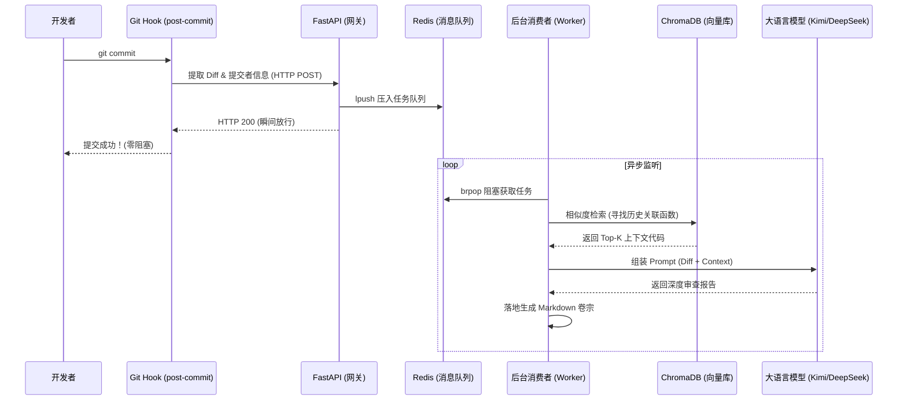

# 🤖 AI-Code-Auditor (异步 RAG 代码审查流)


**AI-Code-Auditor** 是一个基于 `AST 语义切片` 与 `Redis 异步消息队列` 构建的本地大模型代码审查微服务。

它能够无感拦截本地 Git 提交，利用向量数据库（ChromaDB）精准检索项目历史上下文，并调度大语言模型（LLM）进行深度的代码逻辑审查，最终自动生成详尽的 Markdown 审计卷宗。

## ✨ 核心特性 (Features)

*   🚀 **零阻塞的极速体验 (Zero-Blocking Workflow)**：基于 `FastAPI + Redis` 构建解耦架构。利用异步消息队列削峰，`git commit` 瞬间完成，审查任务在后台静默消费，绝不打断开发心流。
*   🧠 **AST 语义级 RAG 引擎 (Semantic RAG)**：摒弃暴力的字符截断，深入编译原理调用 Python `ast` 模块，按“类与函数”物理边界对代码进行精准切片。结合 `ChromaDB` 实现极高准确率的上下文召回，有效消除大模型幻觉。
*   🛡️ **工业级路径鲁棒性 (Robust Architecture)**：内置“特征文件向上探针”算法，彻底解决微服务多入口执行时的“数据库脑裂 (Split-Brain)”漂移问题。生成数据（`.data`）与源码严格物理隔离。
*   📄 **全自动审查卷宗 (Automated Audit Trails)**：自动追踪代码 Diff、关联历史代码片段，并输出带有 RAG 检索诊断信息的高颜值 Markdown 报告。

---

## 🏗️ 系统架构 (Architecture)



---

## 🚀 快速启动 (Quick Start)

### 1. 环境准备 (Prerequisites)

* Python 3.9+
* 本地已安装并启动 **Redis** 服务 (`redis-server`)
* 获取目标大模型 API Key（默认适配 OpenAI SDK 规范，如 Kimi / DeepSeek）

### 2. 安装与配置 (Installation)

克隆项目并安装依赖：

```bash
git clone [https://github.com/你的用户名/AI-Code-Auditor.git](https://github.com/你的用户名/AI-Code-Auditor.git)
cd AI-Code-Auditor
pip install fastapi uvicorn redis chromadb openai python-dotenv

```

在项目根目录创建 `.env` 文件，填入你的 API 配置：

```env
MOONSHOT_API_KEY=sk-your-api-key-here
# 如果使用其他模型，可在 core/llm_service.py 中修改 base_url

```

### 3. 全量构建知识库 (Initialize Database)

首次使用或项目发生大重构时，执行冷启动脚本扫描全盘代码，构建 AST 向量特征：

```bash
python scripts/init_db.py

```

*(注：构建成功后，根目录会自动生成 `.data/chroma_db` 文件夹。)*

### 4. 启动微服务矩阵 (Start Services)

请打开**两个**独立的终端窗口，分别启动网关与消费者：

**终端 1：启动 FastAPI 接收端**

```bash
uvicorn main:app --port 8000

```

**终端 2：启动异步调度 Worker**

```bash
python worker/worker.py

```

### 5. 挂载 Git Hook 触发器 (Setup Git Hook)

将项目提供的触发脚本链接到 `.git/hooks` 中：

```bash
# 复制或建立软链接
cp scripts/trigger_review.py .git/hooks/post-commit
chmod +x .git/hooks/post-commit

```

打开 `.git/hooks/post-commit`，确保执行命令为 `python3 scripts/trigger_review.py`。

---

## 🎮 使用指南 (Usage)

环境启动后，你只需像往常一样编写代码并提交：

```bash
git add .
git commit -m "feat: 重构了 AST 提取逻辑"

```

**魔法发生：**

1. 你的终端会瞬间提示提交成功，不产生任何等待。
2. 观察 **Worker 终端**，你会看到任务被捕获、关联代码被召回、LLM 正在生成报告。
3. 打开根目录下的 `.data/review_reports/` 文件夹，查看最新生成的 Markdown 审查卷宗！

---

## 📂 目录结构 (Project Structure)

```text
.
├── .data/                  # 运行时自动生成的隔离数据 (不入 Git)
│   ├── chroma_db/          # 向量数据库物理文件
│   └── review_reports/     # 生成的 Markdown 审查报告
├── Database/               # 数据库核心层
│   └── vector_db.py        # 探针寻址、AST 切片与向量库控制逻辑
├── core/                   # 核心服务层
│   └── llm_service.py      # LLM 交互与 Prompt 工程
├── scripts/                # 运维与触发脚本
│   ├── init_db.py          # 知识库全量冷启动脚本
│   └── trigger_review.py   # Git Hook 触发器
├── worker/                 # 消费者层
│   └── worker.py           # Redis 监听与核心调度逻辑
├── main.py                 # FastAPI 入口路由
└── README.md

```

## 🤝 贡献与许可 (License)

本项目采用 MIT 协议开源。欢迎提交 Issue 探讨基于 AST 的 RAG 优化方案。


